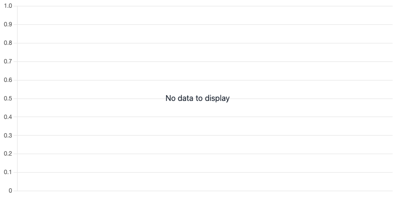

# chartjs-plugin-placeholder

A placeholder text plugin for Chart.js >= 4.0.0.



```js
import Chart from 'chart.js/auto'
import { PluginPlaceholder } from "chartjs-plugin-placeholder"

Chart.register(PluginPlaceholder)

const ctx = document.getElementById('myChart');

let chart = new Chart(ctx, {
  type: 'line',
  // When there is no data in the chart, the plugin will render
  // "No Data" placeholder text.
  data: {},
  options: {
    scales: {
      y: {
        beginAtZero: true
      }
    },
    plugins: {
      placeholder: {
        backgroundMode: "maintain"
      }
    }
  }
});
```

## Configuration

This plugin has several options for configuring the placeholder.

```typescript
export interface PluginOptions {
    // The `backgroundMode` option determines whether the chart axes should be
    // rendered with the placeholder text, or if the canvas should be cleared.
    backgroundMode: "clear" | "maintain",
    // The `font` property is passed directly to `CanvasRenderingContext2D.font`
    // https://developer.mozilla.org/en-US/docs/Web/API/CanvasRenderingContext2D/font
    font: string | null,
    // The `fillStyle` property is passed directly to `CanvasRenderingContext2D.fillStyle`
    // https://developer.mozilla.org/en-US/docs/Web/API/CanvasRenderingContext2D/fillStyle
    fillStyle: string,
}
```
